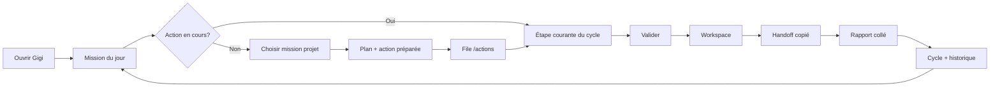

# Gigi V3.0 — Closed Loop Mission OS

> **Nom produit :** Gigi  
> **Version :** V3.0 — Closed Loop Mission OS  
> **Statut :** Scope défini post-audit V2.12  
> **Prérequis :** V2.11.0 mergée, audit [V3_READINESS_AUDIT.md](./V3_READINESS_AUDIT.md)

---

## Promesse V3

```text
Ouvre Gigi. Sache quoi faire. Exécute — manuellement, avec toute la boucle sous les yeux.
```

V3 unifie la chaîne V2.x derrière une **expérience mission-first** : une mission, une action en cours, une prochaine étape claire — sans ajouter d'exécution automatique ni sync cloud implicite.

Tagline inchangée : **« Une action. Aucun bruit. »**

---

## Ce que V3 inclut

### Produit

- **Hub mission** (`/`) : mission du jour + état du cycle en cours (lifecycle simplifié)
- **Parcours action guidé** : étapes visibles (valider → workspace → handoff → rapport → cycle) sans empiler 6 panneaux par défaut
- **Prochaine étape omniprésente** : chaque écran principal indique la suite concrète
- **Cycle fermé lisible** : lifecycle V2.11 comme vue synthèse, pas comme écran caché
- **Historique & apprentissage** : V2.4 + V2.5 intégrés au retour mission
- **Conversation Gigi** : intents V2.x conservés ; preview sans persist non autorisé pour création cycle
- **Local-first** : toutes les clés v03–v211 préservées

### Technique

- Réutilisation modules V1.6–V2.11 **sans suppression**
- Simplification composants UI (progressive disclosure)
- Harmonisation labels FR (« Valider », « Copier handoff », « Coller rapport »)
- Documentation utilisateur courte (1 page « Comment Gigi fonctionne »)
- Lint providers : objectif vert ou exceptions documentées avant release V3.0

---

## Ce que V3 n'inclut PAS

```text
❌ Exécution réelle (commandes, Git, agents, n8n)
❌ Vérification GitHub / repo / build automatique
❌ Appels Supabase / sync / restore automatiques
❌ Nouvelle clé localStorage sans version bump explicite
❌ Auto-approve, auto-complete, auto-close cycle
❌ Paiement, landing publique, multi-tenant SaaS
❌ Mémoire cloud ou sync données V2.x
❌ Renommage repo ou package.json
❌ Modification .env.local depuis l'app
```

---

## Parcours utilisateur cible



### Écrans clés

| Écran | Rôle V3 |
|-------|---------|
| `/` | Mission + résumé cycle actif + CTA « Continuer l'action » |
| `/projects/[id]` | Contexte projet ; mission recommandée ; lien plan |
| `/actions` | File + **vue étape courante** (pas tous les panneaux ouverts) |
| `/history` | Apprentissage + cycles archivés |
| `/conversation` | Assistant ; deep-links vers étape manquante |

---

## Écrans à simplifier

1. **`QueuedActionCard`** — remplacer 6 boutons par stepper ou onglets (Détails | Workspace | Handoff | Rapport | Cycle)
2. **`/actions`** — filtre « En cours de cycle » vs « À valider »
3. **`/`** — bandeau cycle actif si lifecycle `active`
4. **`/history`** — regrouper résumés V2.6–V2.11 en une section « Cycles récents »

---

## Modules à cacher derrière l'UX

L'utilisateur ne voit plus les numéros de version ; l'UX parle en langage produit :

| Module interne | Label UX V3 |
|----------------|-------------|
| actionQueue | « À valider » |
| executionPlans | « Plan d'exécution » |
| safeActionWorkspace | « Espace de préparation » |
| manualExecutionHandoff | « Passer à Cursor / humain » |
| executionReportIntake | « Rapport reçu » |
| closedLoopLifecycle | « Cycle de l'action » |
| missionDecision | « Choisir la mission » |
| historyLearning | « Ce que j'ai appris » |

---

## Limites de sécurité (inchangées)

- Toute action = **clic utilisateur explicite**
- Copier ≠ exécuter ; Valider ≠ lancer
- Parser rapport = **local** ; apply log = **bouton**
- Disclaimers visibles sur workspace, handoff, intake, lifecycle
- Dev routes (`/dev/*`) restent diagnostics ; pas exposées nav principale

---

## Critères d'acceptation V3.0

### Fonctionnel

- [ ] Nouvel utilisateur : mission → action → handoff en < 5 min (mock)
- [ ] Utilisateur existant : données v19–v211 intactes après upgrade
- [ ] Parcours complet cycle sans reload cassé
- [ ] « Prochaine étape » visible sur `/`, `/actions`, workspace, handoff, intake, lifecycle

### Technique

- [ ] `npm run build` OK
- [ ] Lint global : 0 erreur **ou** liste d'exceptions documentées
- [ ] Aucune nouvelle clé localStorage **ou** justification + doc
- [ ] Audit sécurité V2.x repassé (grep fetch/exec/auto)

### Produit

- [ ] V3_SCOPE.md respecté
- [ ] ROADMAP V3.0 marquée livrée
- [ ] Pas de régression dry-run guardrails V0.6–V2.11

---

## Relation V2.12 → V3.0

V2.12 a conclu **`almost_ready`** :

- Démarrer V3.0 **design + simplification UX** immédiatement
- Traiter lint providers en parallèle ou V2.12.1
- Release tag `v3.0.0` seulement quand critères ci-dessus validés

---

## Vision post-V3 (hors scope V3.0)

- V3.x : polish, tests E2E, onboarding cycle
- V4+ : intégrations réelles **uniquement** sur demande explicite et garde-fous
- SaaS / paiement : roadmap « Later » inchangée
